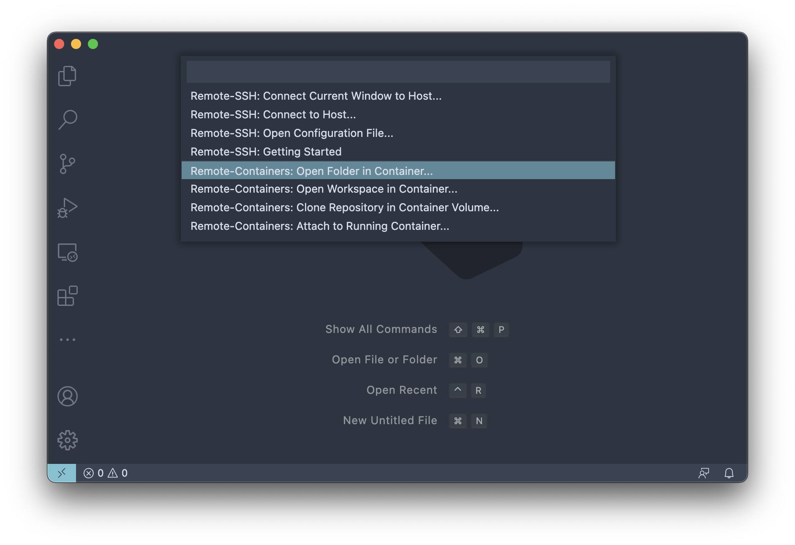
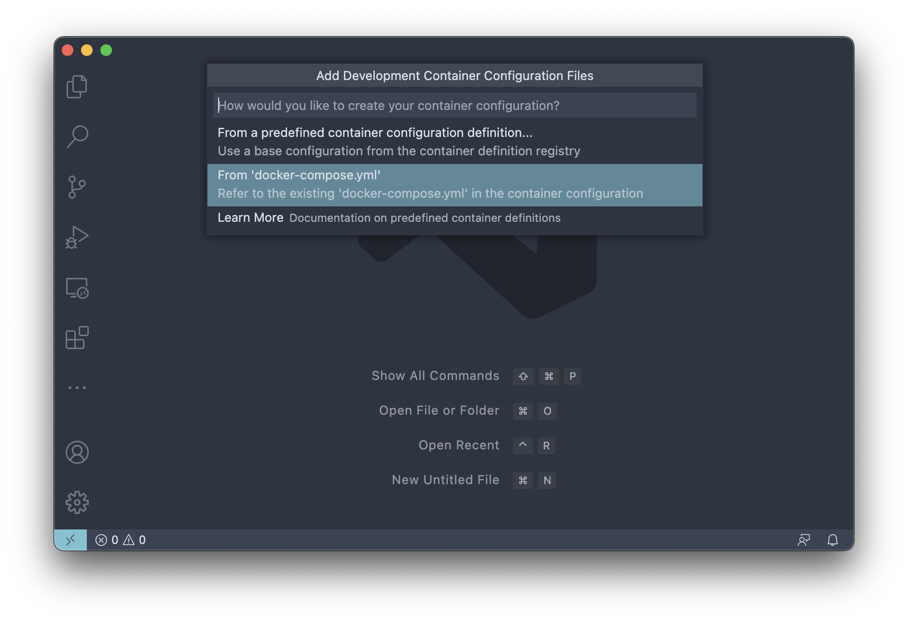
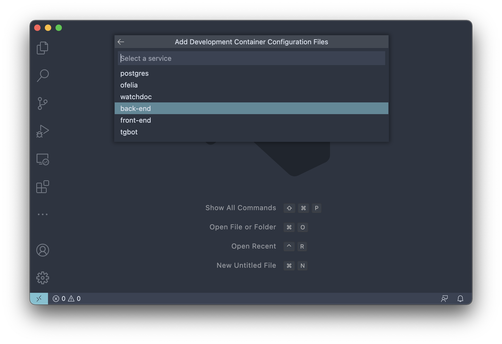
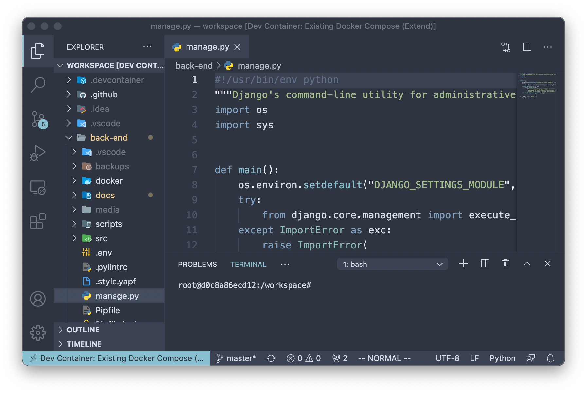

# Development environment

All of the following instructions require Docker.

Docker containers provide production-like environment, stable builds,
and no need for manual management of third-party packages and dependencies.

**WARNING:**
local environments are highly discouraged and will not be supported.

## Table of contents

- [Development environment](#development-environment)
  - [VS Code](#vs-code)
  - [PyCharm](#pycharm)

## VS Code

### Requirements

* Docker
* VS Code Extensions:
  * Remote - Containers

### Steps

1. Make sure Docker is running:
   ```shell script
   docker info
   ```

2. Open VS Code, click on the button in the bottom left corner (or use the command palette) and select `Remote-Containers: Open Folder in Container...`:
   
   
3. Choose `dal` folder.

4. Now you have to select a container image for the development environment. Select `From 'docker-compose.yml'` and choose the `back-end` service as the base image:
   
   

5. Wait for the containers to build. You are done! Now you can install all the necessary extensions and packages in your docker environment. If you have done everything right, your window should look like this (note the bottom left corner):
   

### PS

All files on your machine are mapped to the `/workspace` folder in the container. You can change this in `./devcontainer/devcontainer.js`.

It also makes sense to uncomment the `"runServices": []` field and fill the array with the services that you need for your work (by default, all services are started).

Don't forget to run `git config --global user.name "..."` and `git config --global user.email "..."` if you want to use `git` inside the container.

:warning: **Do not remove your containers!** You should **only stop them**. Otherwise, your environment will be lost. :warning:

## PyCharm

### Requirements

* Docker

### Steps

1. Make sure Docker is running:
   ```shell script
   docker info
   ```

1. In `PyCharm`:
   1. Navigate to `Settings / Preferences` > `Project` > `Project Interpreter`,
      press `⚙` to the right of the `Project Interpreter` field > `Add`:
      

   2. Add new interpreter from Docker Compose configuration:
      

1. You are good to go.
