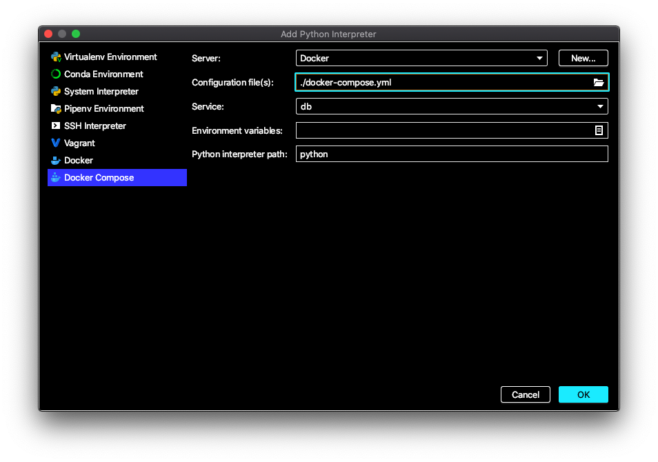
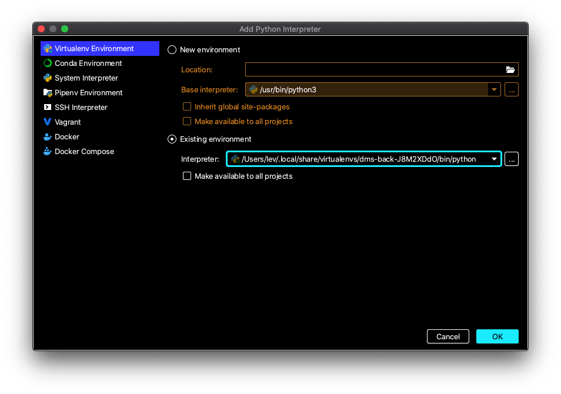

# Development environment

Make a copy of [`.env.example`](../.env.example) and save it to `.env`.

## Table of contents

- [Development environment](#development-environment)
  - [Terminal + Text Editor (Vim, Emacs, ...)](#terminal--text-editor-vim-emacs-)
  - [PyCharm](#pycharm)
    - [With Docker _(highly recommended)_](#with-docker-highly-recommended)
    - [Local Machine _(somewhat discouraged)_](#local-machine-somewhat-discouraged)

## Terminal + Text Editor (Vim, Emacs, ...)

### Requirements

* `pyenv`
* `pipenv`
* `postqresql`

### Steps: Python

1. First things first, make sure that `pyenv` and `pipenv` are installed and working:
   ```shell script
   pyenv --version && pipenv --version
   ```

1. Navigate to the project root:
   ```shell script
   cd dms-back
   ```

1. Install Python 3.8.5:
   ```shell script
   pyenv install 3.8.5
   ```

1. Activate it for the project:
   ```shell script
   pyenv local 3.8.5
   ```

1. Make new virtual environment and install all packages from `Pipfile`:
   ```shell script
   pipenv install --dev
   ```
 
1. Activate project's virtualenv:
   ```shell script
   pipenv shell
   ```

### Steps: PostgreSQL

1. Install [`postgresql`](https://www.postgresql.org/download/).

1. Change `$POSTGRES_HOST` to `localhost` in `.env` file:
   ```shell script
   POSTGRES_HOST=localhost
   ...
   ```

1. From the project's root, export variables from `.env` file:
   ```shell script
   set -o allexport
   source .env
   set +o allexport
   ```

1. Create database:
   ```shell script
   createdb $POSTGRES_DB
   ```

1. Connect to database:
   ```shell script
   psql -d $POSTGRES_DB -v "postgres_user=$POSTGRES_USER" -v "postgres_password=$POSTGRES_PASSWORD"
   ```

1. Create user with password:
   ```postgresql
   CREATE USER :postgres_user WITH PASSWORD :'postgres_password';
   ```

## PyCharm

### With Docker _(highly recommended)_

Docker container provides production-like environment, stable builds,
and no need for manual management of third-party packages and dependencies.

#### Requirements

* Docker

#### Steps

1. Make sure Docker is running:
   ```shell script
   docker info
   ```

1. In `PyCharm`:
   1. Navigate to `Settings / Preferences` > `Project` > `Project Interpreter`,
      press `⚙` to the right of the `Project Interpreter` field > `Add`:
      

   2. Add new interpreter from Docker Compose configuration:
      

1. You are good to go.

### Local Machine _(somewhat discouraged)_

#### Requirements

* Same as for [terminal](#terminal--text-editor-vim-emacs-)

#### Steps

1. Complete all steps from the [terminal](#terminal--text-editor-vim-emacs-) section.

1. Make sure `python --version` yields `3.8.5` and get path to `python` binary:
   ```shell script
   $ which python
   SOME_VERY_LONG_PATH
   ```

1. In `PyCharm`:
   1. Navigate to `Settings / Preferences` > `Project` > `Project Interpreter`,
      press `⚙` to the right of the `Project Interpreter` field > `Add`:
      
 
   1. Choose `Virtualenv Environment` > `Existing environment`, paste `SOME_VERY_LONG_PATH` to `Interpreter` field: 
      
 
1. Done.
